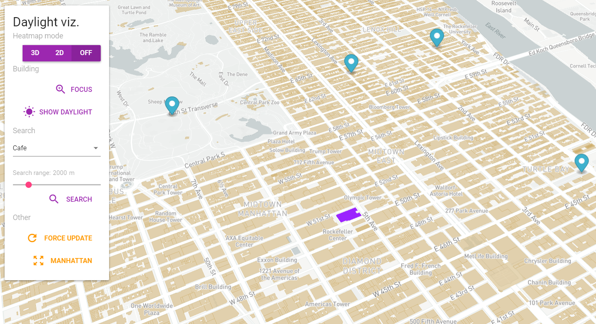

# Overview

This application visualizes building height in Manhattan on map. Most important features:
- visualize height of all buildings in Manhattan (3D, 2D)
- select any building and view its height and current amenity
- calculate incoming sunlight direction throughout the day. 
- find buildings of interest by their amenity.

### Screenshots:

**Heightmap, Daylight and occluding buildings:**

**3D**

**2D**

**Search:**

The application has 2 separate parts, the client which is a [frontend web application](#frontend) using mapbox API and mapbox.js and the [backend application](#backend) written in [Rails](http://rubyonrails.org/), backed by PostGIS. The frontend application communicates with backend using a [REST API](#api).

# Frontend

The frontend application is dynamic HTML page using one controller and ONE view, which shows `MapBox GL JS` widget. The app is SPA (Single page application). The map controller handles all use cases.
- On load application shows basic height visualization.
- By clicking on any building's base (3D interaction is not supported by MapBox GL JS), shows popup with building data.
- Clicking "Show daylight" will calculate incoming sunlight throughout the day and visualize it.
- Selecting amenity in select form, choosing range and then clicking search will add markers for buildings meeting criteria.

All relevant frontend code is in `app/views/map/show.html.erb`. The frontend code is quite simple, its responsibilities are:

- displaying the sidebar panel controls, driving the user interaction and calling the appropriate backend APIs
- displaying geo features by overlaying the map with a geojson layer, the geojson is provided directly by backend APIs
- enhancing geojson from backend with MapBox related properties for visualization
- periodically updating heatmap data with current viewing region

# Backend

The backend application is written in Ruby on Rails and is responsible for querying geo data, formatting the geojson and data for MapBox and Sidebar controls.

## Data

The building date is coming from [Overpass-Turbo](http://overpass-turbo.eu/), which provides prefiltered data from `Open Street Maps`. I used it to query just the buildings data from Manhattan region. Imported it using the `ogr2ogr` tool directly into the Postgis database. Thanks to rails an index was automaticaly created on geometry column (`wkb_geometry`) in all tables. The application follows standard Rails conventions and all queries are placed in models inside app/models, mostly in `app/models/building.rb`. GeoJSON is generated by using rgeo-geojson gem and some postprocessing is necessary for every model in app/models with method `build_geojson`.

## Api

**Get the incoming sunlight area approximation for coordinates**

`GET /map/test_sun_occlusion?lng=-73.9896315748146&lat=40.759086348993`

**Get the buildings with specified amenity in the distance from coordinates**

`GET /map/amenity_search?lng=-73.9870692347223&lat=40.756591969998&dist=5500&amenity=arts_centre`

**Get building height data in the radius coordinates and specified radius**

`GET /map/heatmap_camera_update?lng=-73.98236056619095&lat=40.75587360748381&dist=25.581219838079456`

### Response

API calls return geojson feature collection responses with all additional data in `properties` as specified by geojson specification.